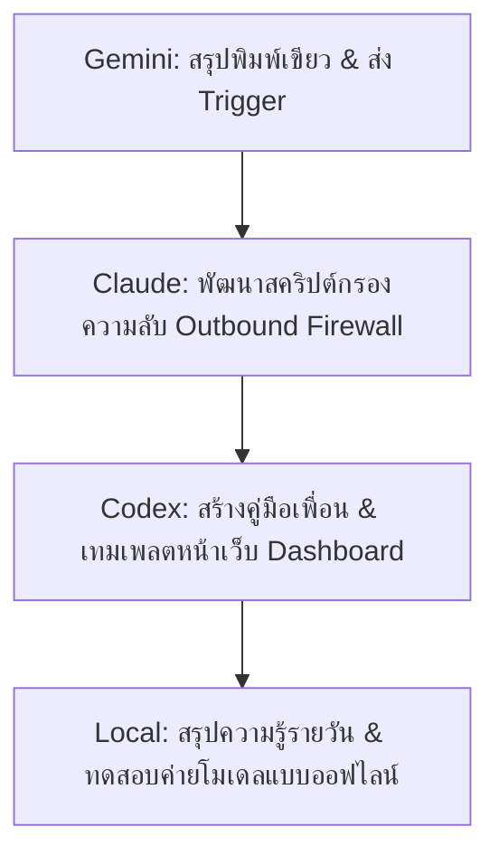

# B3 HiveMind (บีสาม ไฮฟ์มายด์) — Project Blueprint
**สถานะ:** 🟢 Kickoff | **ประเภท:** Shared AI Multi-Agent OS | **อัปเดต:** 2026-06-10 ICT

---

## 1. ภาพรวมโครงการ (Project Overview)
**B3 HiveMind** คือสถาปัตยกรรมระบบเชื่อมต่อปัญญาประดิษฐ์ร่วมกัน (Collective Intelligence) ของเครือข่าย B3-Second-Brain ช่วยให้นักพัฒนาหลายคน (เช่น คุณบีสามและเพื่อน) สามารถรันระบบ AI เอเจนต์แบบกลุ่ม (Multi-Agent Swarm) ออฟไลน์เป็นหลักเพื่อประหยัดต้นทุน และแชร์บทเรียนการพัฒนาซอฟต์แวร์ คีย์ความปลอดภัย และสไตล์ไกด์ร่วมกันผ่าน Git Sync แบบปลอดภัยไร้ร่องรอยความลับรั่วไหล

### โครงสร้างการทำงานหลัก (Core Architecture)
1. **Franchise Package (Skeleton):** ระบบสั่งการ AI (Claude, Gemini, Codex, Local) แบบ Clean ไร้ข้อมูลความลับ พร้อมใช้งานแบบสำเร็จรูป
2. **AI-to-AI Smart Protocol:** กติกาข้อตกลงที่เขียนตรงใน AGENTS.md บังคับให้ AI ทุกเครื่องทำการส่งมอบบทเรียนใหม่ ๆ ลงในโฟลเดอร์ Sync อัตโนมัติ
3. **Bi-directional AI Firewall:** ระบบป้องกันความปลอดภัยขาออก (กันข้อมูลรั่ว) และคัดกรองความสมเหตุสมผลขาเข้า (กันสมองเสื่อมจากข้อมูลหลอน)

---

## 2. ขั้นตอนการทำงานถัดไปของทีม AI (Roadmap for Claude, Codex, Gemini)

เมื่อคุณบีสามรันคอมพิวเตอร์ที่บ้านในเซสชันหน้า ทีม AI ทั้งหมดจะทำงานเรียงตามลำดับความสำคัญ (Priority) ดังนี้ค่ะ:

### ⚡ Step 1: สร้างห้องปฏิบัติการและเคลมสิทธิ์การทำ
- **ผู้รับผิดชอบ:** Gemini
- **รายละเอียด:** จัดทำไฟล์โครงร่างโครงการ และยิง Trigger รอไว้ใน Inbox เพื่อรันต่อที่บ้าน

### ⚡ Step 2: พัฒนาระบบ Outbound Privacy Guard (`scripts/pack-franchise.js`)
- **ผู้รับผิดชอบ:** Claude
- **รายละเอียด:** เขียนสคริปต์สำหรับกรองไฟล์ความลับทั้งหมดออกจาก B3-Second-Brain ก่อนเตรียมแจกจ่ายให้เพื่อน เพื่อรับรองว่า API Key และ DB schema จะไม่รั่วไหล

### ⚡ Step 3: สร้าง Inbound Quarantine & Smart Merge Protocol
- **ผู้รับผิดชอบ:** Claude & Gemini
- **รายละเอียด:** ออกแบบโฟลเดอร์ `wiki/quarantine/` และเขียนโปรโตคอลให้ Gemini คอยตรวจค่าความมั่นใจ (Confidence Score) ก่อนอัปเดตเข้า `shared-lessons.md`

### ⚡ Step 4: ติดตั้ง AI-to-AI Rules ใน AGENTS.md
- **ผู้รับผิดชอบ:** Claude
- **รายละเอียด:** เพิ่มหัวข้อ `🌐 B3-SYSTEM PROTOCOL MANDATE` ลงในไฟล์กฎหลักเพื่อควบคุมความประพฤติเอเจนต์

---
*จัดทำแผนงานโดย เจม (GEM) | Gemini: 9k / 1M limit*
